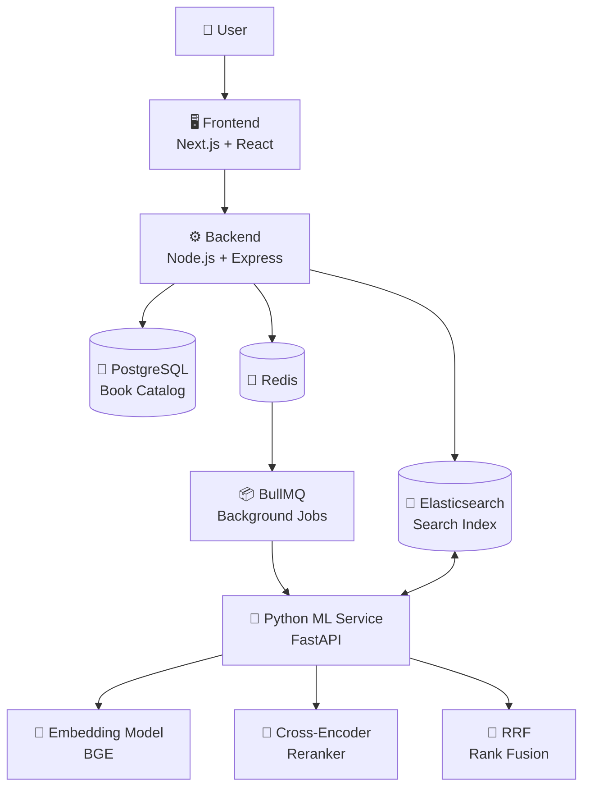
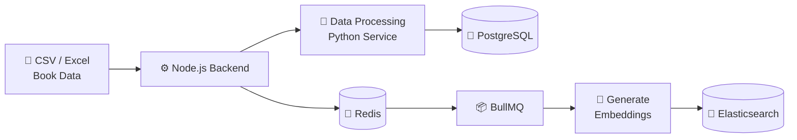
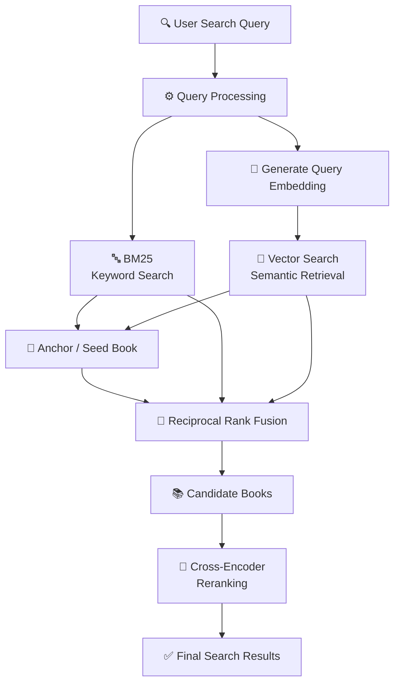
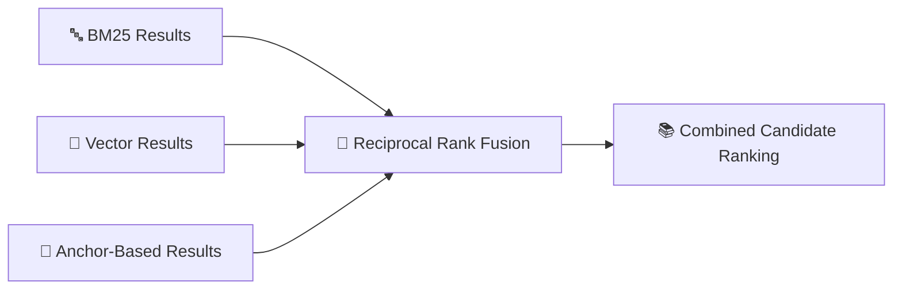
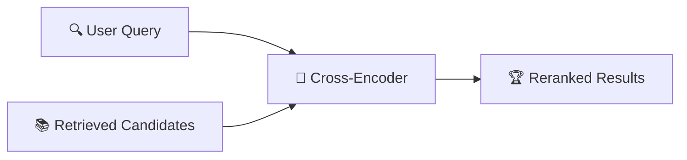
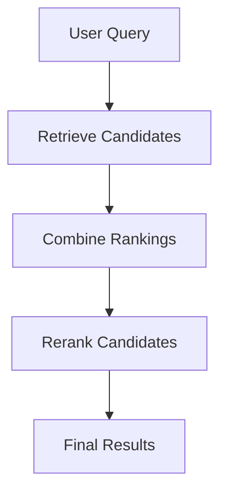
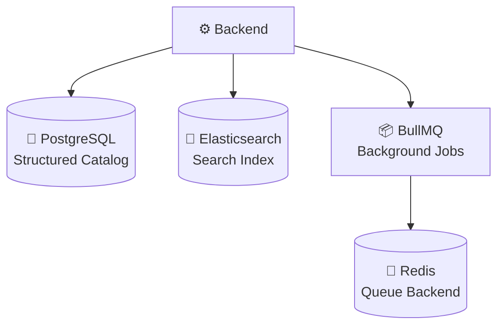
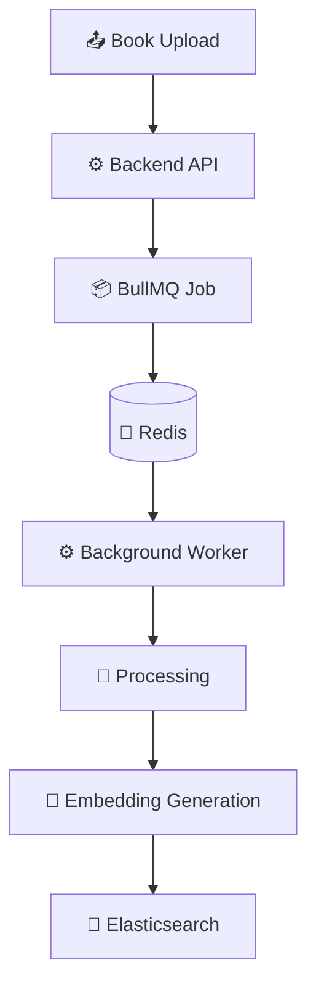
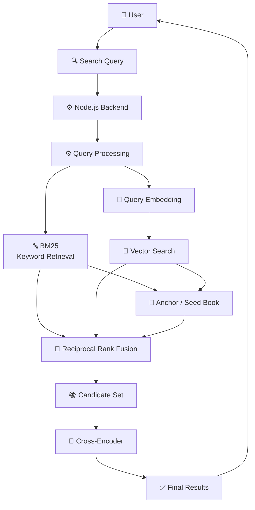
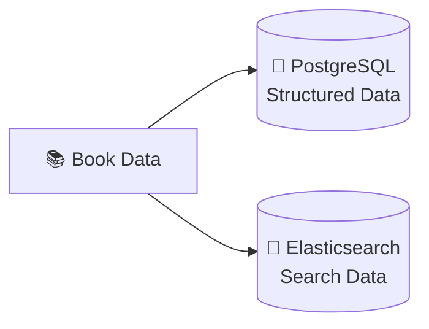

# 📚 Library Search Engine

A hybrid search engine for library book catalogs that combines **traditional keyword search** with **semantic vector search** to find relevant books even when the user's query does not exactly match the book's title or metadata.

The system is built as a multi-service application using **Next.js, Node.js/Express, PostgreSQL, Elasticsearch, Redis/BullMQ, and Python/FastAPI** for machine-learning based processing.

---

## ✨ What This Project Does

The Library Search Engine provides:

* 🔎 **Hybrid search** combining keyword and semantic retrieval
* 🧠 **Semantic search** using dense vector embeddings
* 📖 **Book catalog management**
* 📂 **Bulk book upload** through structured files
* ⚡ **Asynchronous processing** for large uploads
* 🎯 **Cross-encoder reranking** for improving search relevance
* 🔀 **Reciprocal Rank Fusion (RRF)** for combining multiple retrieval strategies
* 🏷️ **Metadata-based filtering**
* 🗑️ **Book deletion**
* 🌐 **Web-based interface** for searching and managing the library catalog

The project explores how classical Information Retrieval techniques can be combined with modern semantic-search and machine-learning techniques to build a more capable search system.

---

# 🏗️ Architecture

The application is divided into several services, each responsible for a specific part of the system.



### Component Responsibilities

| Component             | Responsibility                                             |
| --------------------- | ---------------------------------------------------------- |
| **Next.js Frontend**  | User interface, search interaction and book management     |
| **Node.js + Express** | Main API, business logic and coordination between services |
| **PostgreSQL**        | Primary structured storage for the book catalog            |
| **Elasticsearch**     | Keyword search, vector search and search indexing          |
| **Redis**             | Queue infrastructure                                       |
| **BullMQ**            | Background processing of large upload jobs                 |
| **FastAPI**           | ML-related processing exposed through HTTP APIs            |
| **Embedding Model**   | Converts book/query text into semantic vectors             |
| **Cross-Encoder**     | Reranks retrieved books against the user's query           |
| **RRF**               | Combines rankings from multiple retrieval strategies       |

---

# 🔄 Book Ingestion Flow

Book data can be added individually or through bulk uploads.

For large uploads, the system uses a background processing pipeline instead of performing the entire operation inside a single HTTP request.



### High-level process

1. Book data is received by the backend.
2. The data is validated and processed.
3. Structured book information is stored in PostgreSQL.
4. Large processing tasks are submitted to BullMQ.
5. Redis acts as the queue backend.
6. Background workers process the uploaded books.
7. Embeddings are generated for searchable content.
8. The processed representation is indexed in Elasticsearch.

This allows expensive processing to happen asynchronously without keeping the original upload request running for the entire operation.

---

# 🔎 Search Architecture

The search system uses multiple retrieval techniques instead of relying on a single search method.

At a high level:



---

# 🔍 How Search Works

The search pipeline can be understood as several stages.

## 1. Query Processing

The user enters a natural-language search query.

For example:

```text
fantasy story about a young wizard fighting dark magic
```

The query is processed for both traditional and semantic retrieval.

---

## 2. Keyword Retrieval

Elasticsearch performs traditional text-based retrieval using **BM25**.

This is useful when the query contains words that directly occur in:

* book titles
* authors
* descriptions
* categories
* publishers
* other searchable metadata

For example:

```text
The Hobbit
```

is naturally handled well by keyword retrieval.

---

## 3. Semantic Retrieval

The query is converted into an embedding using the embedding model.

The resulting vector is compared against book vectors stored in Elasticsearch.

This allows queries to retrieve books based on **meaning and contextual similarity**, rather than requiring exact word matches.

For example:

```text
a fantasy story about a young wizard fighting dark magic
```

can retrieve relevant books even when the exact words in the query are not present in their descriptions.

---

# 📌 Anchor Book Retrieval

The search implementation also uses an **anchor/seed book** during the retrieval process.

The initial keyword and semantic searches help identify a highly relevant book that can be used as an additional semantic reference.

The broader retrieval process can therefore consider:

* Query → Book similarity
* Anchor Book → Book similarity
* Keyword relevance

This provides another way of discovering books that may be related to the user's query.

---

# 🔀 Reciprocal Rank Fusion

The different retrieval strategies produce rankings that are not directly comparable as raw scores.

For example:

```text
BM25 score       → one scoring scale
Vector similarity → another scoring scale
```

Instead of simply adding these raw scores, the system uses **Reciprocal Rank Fusion (RRF)** to combine their rankings.



RRF works with the positions of documents in the different rankings, allowing results from different retrieval strategies to be combined without requiring their raw scores to have the same scale.

---

# 🎯 Cross-Encoder Reranking

After retrieving a candidate set, the system uses a **cross-encoder** to perform another relevance evaluation.



The cross-encoder considers the relationship between the query and each candidate book and produces a relevance score used for the final ordering.

This creates a multi-stage search architecture:



The purpose of this architecture is to keep the initial retrieval stage broad and efficient while using the more expensive reranking stage on a smaller candidate set.

---

# 🧠 Machine Learning Components

The Python service contains the machine-learning related components of the system.

## Embedding Model

The current embedding model is:

```text
BAAI/bge-large-en-v1.5
```

The model generates **1024-dimensional embeddings**.

These embeddings are used for semantic search and are stored in Elasticsearch as dense vectors.

The system maintains separate embeddings for different types of book information, including:

* title representation
* contextual/description representation

This allows different aspects of a book to participate in semantic retrieval.

---

## Cross-Encoder

The current reranking model is:

```text
mixedbread-ai/mxbai-rerank-base-v1
```

It is used after the initial retrieval stage to evaluate query-to-book relevance more directly.

This creates a two-stage retrieval architecture:


---

# 🗄️ Storage Architecture

Different storage technologies are used for different purposes.



### PostgreSQL

PostgreSQL acts as the structured source for the book catalog.

It stores information such as:

* title
* author
* ISBN
* publisher
* categories
* descriptions
* ratings
* other book metadata

---

### Elasticsearch

Elasticsearch provides the search-oriented representation of the catalog.

It supports:

* keyword search
* BM25 retrieval
* vector search
* metadata filtering
* indexed book retrieval

The Elasticsearch index contains both textual information and vector representations of the books.

---

### Redis + BullMQ

Redis is used as the underlying queue infrastructure for BullMQ.

BullMQ manages background processing tasks, particularly for large book uploads and indexing operations.

---

# 📊 Elasticsearch

The Elasticsearch index contains searchable book information such as:

* title
* author
* publisher
* categories
* description
* ISBN
* publication year
* format
* reading level
* rating
* title embedding
* context embedding

Text fields use analyzers suitable for search, while vector fields allow semantic similarity retrieval.

---

# ⚡ Background Processing

Large catalog operations can require significant processing because books may need to be:

1. validated
2. preprocessed
3. converted into embeddings
4. indexed into Elasticsearch

Instead of performing all of this synchronously, the system uses a queue.



This architecture allows the API to hand off expensive work to background processing instead of blocking the request for the complete duration of the operation.

---

# 📁 Project Structure

```text
library_search_engine/
│
├── backend/
│   ├── controllers/
│   │   └── Book-related API logic
│   │
│   ├── routes/
│   │   └── API routes
│   │
│   ├── elasticsearch/
│   │   ├── Search logic
│   │   ├── Index configuration
│   │   └── Filtering / deletion
│   │
│   ├── bullmq/
│   │   └── Background job queues
│   │
│   ├── db/
│   │   └── PostgreSQL access
│   │
│   ├── lib/
│   │   └── Communication with Python services
│   │
│   ├── schema/
│   │   └── Request validation
│   │
│   ├── app.js
│   └── server.js
│
├── frontend/
│   └── Next.js application
│
├── python_server/
│   ├── embedding_model/
│   │   └── Embedding generation
│   │
│   ├── cross_encoder/
│   │   └── Result reranking
│   │
│   ├── rrf_ranking/
│   │   └── Ranking fusion
│   │
│   └── server.py
│
├── scraping/
│   └── Data acquisition / scraping utilities
│
├── notes.md
├── requirments.txt
└── library search engine high level design.drawio
```

---

# 🛠️ Tech Stack

## Frontend

* **Next.js**
* **React**
* **TypeScript**
* **Redux Toolkit**
* **Tailwind CSS**
* **shadcn/ui**
* **Axios**
* **Framer Motion**

---

## Backend

* **Node.js**
* **Express.js**
* **PostgreSQL**
* **Elasticsearch**
* **Redis**
* **BullMQ**
* **Axios**
* **Zod**
* **Jest**

---

## Python Services

* **Python**
* **FastAPI**
* **Sentence Transformers**
* **PyTorch**
* **Pandas**
* **NumPy**
* **BGE Embeddings**
* **Cross-Encoder**

---

# 📋 Prerequisites

Before running the project locally, make sure the following are installed:

* **Node.js**
* **npm**
* **Python 3**
* **PostgreSQL**
* **Elasticsearch 8.x**
* **Redis**

The Python ML components also require enough system resources to load and run the embedding and reranking models.

A GPU is not strictly required for local development, although hardware acceleration can significantly improve ML processing performance.

---

# 🚀 Running Locally

The project consists of multiple services, so each service should be started separately.

---

## 1. Clone the Repository

```bash
git clone https://github.com/anirban2005143a/library_search_engine.git

cd library_search_engine
```

---

# 2. Start PostgreSQL

Create a PostgreSQL database for the project.

The backend expects PostgreSQL configuration through environment variables such as:

```env
PG_USER=postgres
PG_PASSWORD=your_password
PG_DATABASE=library_db
PG_HOST=localhost
PG_PORT=5432

TABLE_NAME=books
```

Use the credentials and database name appropriate for your local environment.

---

# 3. Start Elasticsearch

Start a local Elasticsearch 8.x instance.

Example configuration:

```env
ELASTIC_SEARCH_URL=https://localhost:9200
ELASTIC_SEARCH_USER=elastic
ELASTIC_SEARCH_PASS=your_password

INDEX_NAME=books
```

Make sure Elasticsearch is accessible from the backend before starting the application.

> ⚠️ **Development warning:** the current backend startup behavior recreates the configured Elasticsearch index. Do not point a development instance at an Elasticsearch index containing data that you want to preserve.

---

# 4. Start Redis

Redis is required for BullMQ background jobs.

For a local Redis installation:

```env
REDIS_HOST=127.0.0.1
REDIS_PORT=6379
```

Make sure Redis is running before starting the backend.

---

# 5. Start the Python Service

Move into the Python service:

```bash
cd python_server
```

Install the project dependencies:

```bash
pip install -r ../requirments.txt
```

Start the FastAPI application using the project's Python server entry point.

The backend communicates with the Python service through:

```env
PYTHON_SERVER_URL=http://localhost:8000
```

The Python service loads the embedding and reranking models when it starts.

> ℹ️ The first startup can take longer because the required ML models may need to be downloaded and loaded.

---

# 6. Start the Backend

Open another terminal:

```bash
cd backend
```

Install dependencies:

```bash
npm install
```

Start the development server:

```bash
npm run dev
```

The backend normally runs on:

```text
http://localhost:6000
```

The port can be changed through:

```env
PORT=6000
```

---

# 7. Start the Frontend

Open another terminal:

```bash
cd frontend
```

Install dependencies:

```bash
npm install
```

Start the development server:

```bash
npm run dev
```

The frontend will normally be available at:

```text
http://localhost:3000
```

---

# 🔐 Environment Variables

A typical local backend configuration can look like:

```env
PORT=6000

# PostgreSQL
PG_USER=postgres
PG_PASSWORD=your_password
PG_DATABASE=library_db
PG_HOST=localhost
PG_PORT=5432
TABLE_NAME=books

# Elasticsearch
ELASTIC_SEARCH_URL=https://localhost:9200
ELASTIC_SEARCH_USER=elastic
ELASTIC_SEARCH_PASS=your_password
INDEX_NAME=books

# Python ML service
PYTHON_SERVER_URL=http://localhost:8000

# Redis
REDIS_HOST=127.0.0.1
REDIS_PORT=6379

# BullMQ
UPLOADING_QUEUE_NAME=uploading_queue
```

Do not commit real credentials or secrets to the repository.

---

# 📡 API Overview

The backend exposes book-related operations under:

```text
/api/books
```

## Search

```http
POST /api/books/search
```

Runs the hybrid search pipeline and returns relevant books.

---

## Upload

```http
POST /api/books/upload
```

Accepts book data or uploaded files and sends larger processing tasks through the background processing pipeline.

---

## Filter

```http
POST /api/books/filter
```

Filters books using structured metadata.

---

## Get Book

```http
GET /api/books/:id
```

Returns information about a specific book.

---

## Delete Book

```http
DELETE /api/books/delete/:id
```

Removes a book from the catalog/search system.

---

# 🧪 Testing

The backend uses Jest for automated tests.

Run:

```bash
cd backend

npm test
```

For watch mode:

```bash
npm run test:watch
```

---

# 🔬 Search Pipeline — Complete View

The complete search architecture can be summarized as:



This represents the overall search strategy without exposing the low-level implementation details.

---

# 💡 Why Hybrid Search?

Keyword and semantic search are useful for different types of queries.

### Keyword Search

Useful when the user knows specific information such as:

```text
The Hobbit
```

or:

```text
J. R. R. Tolkien
```

Keyword retrieval can directly match these terms against indexed book information.

### Semantic Search

Useful when the user describes an idea:

```text
A fantasy story about a young wizard fighting dark magic
```

The system can use vector similarity to find books with similar meaning even when the exact query words do not appear in the book metadata.

### Hybrid Search

The project combines these approaches so that both textual matching and semantic similarity can contribute to the final results.

---

# 📌 Important Design Decisions

## PostgreSQL + Elasticsearch

The project separates structured storage from search-oriented storage.



PostgreSQL acts as the structured catalog, while Elasticsearch provides the search capabilities.

---

## Separate Python ML Service

The ML models are isolated in a Python/FastAPI service instead of being loaded directly inside the Node.js application.


This separation keeps the main API service independent from the Python ML runtime.

---

## Asynchronous Upload Processing

Large catalog uploads may require significant processing.

Instead of making the API perform everything synchronously:


This allows expensive work to happen in the background.

---

## Multi-Stage Search

The search system separates retrieval from reranking:


The first stage focuses on retrieving a sufficiently broad candidate set, while the reranking stage performs a more detailed relevance evaluation.

---

# ⚠️ Development Notes

This repository is primarily a development/research project, and some parts of the implementation are still evolving.

Important points to be aware of:

* Search caching and pagination have partially implemented code paths.
* Some Redis-based search caching functionality is currently disabled/commented out.
* The search and indexing pipeline is still being refined.
* The current backend startup behavior recreates the Elasticsearch index.
* The current PostgreSQL startup logic also contains development-oriented table recreation behavior.

Therefore, the current local setup should be considered a **development configuration rather than a production deployment configuration**.

---

# 🗺️ Possible Future Improvements

Some natural directions for extending the project include:

* Incremental Elasticsearch indexing
* More efficient pagination
* Search-result caching
* Search suggestions/autocomplete
* Improved metadata filtering
* Better query understanding
* More advanced ranking strategies
* Improved handling of failed background jobs
* Streaming or more efficient large-file uploads
* More comprehensive automated tests
* Production-oriented deployment configuration
* Monitoring and observability
* Improved model serving and inference performance

---

# 📚 Additional Documentation

The repository contains additional project documentation:

### `notes.md`

Contains development notes and decisions related to the search pipeline.

### `library search engine high level design.drawio`

Contains the high-level system architecture.

### `search_query_flow_design.drawio`

Contains the search-flow design.

These files provide additional context if you want to understand the evolution and design of the system in more detail.

---

# 🤝 Contributing

Contributions and improvements are welcome.

Create a feature branch:

```bash
git checkout -b feature/your-feature
```

Make your changes, test them locally, and open a pull request.

---

# 📄 License

This project is licensed under the **ISC License**.

---

# 👨‍💻 Project

## Library Search Engine

A search system combining:

**Next.js · React · Node.js · Express · PostgreSQL · Elasticsearch · Redis · BullMQ · FastAPI · Sentence Transformers · BGE · Cross-Encoder**

The project explores how **traditional Information Retrieval, semantic search, ranking fusion, and machine-learning based reranking** can work together to build a modern library search engine.
