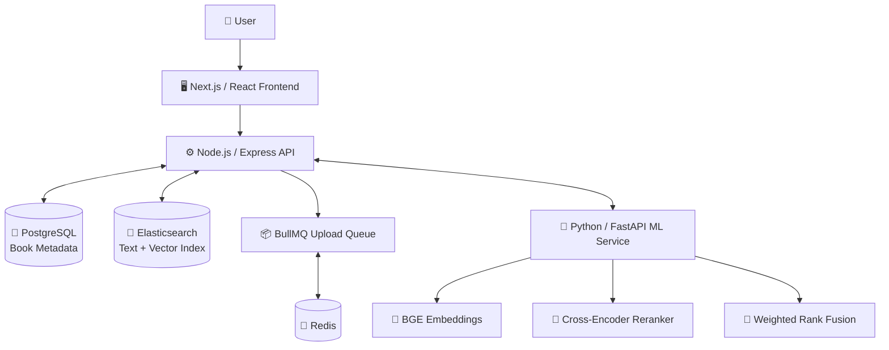

# 📚 Library Search Engine

A full-stack library search application that helps users discover books using natural-language queries, exact keywords, and book metadata. The search pipeline combines Elasticsearch text retrieval with semantic embeddings, seed-book/anchor retrieval, weighted rank fusion, and cross-encoder reranking.

The project is split into a **Next.js frontend**, a **Node.js + Express API**, **PostgreSQL** for structured book metadata, **Elasticsearch** for search and vector indexing, **Redis + BullMQ** for queued upload/indexing work, and a **Python + FastAPI service** for ML-related operations.

> **Development status:** This repository is an actively developed project, not a ready-to-deploy production template. See [Known implementation notes](#️-known-implementation-notes) before starting it.

---

## ✨ Features

- 🔎 **Hybrid book search** using keyword relevance (BM25) and semantic vector similarity.
- 🧠 **Semantic retrieval** using title and context/description embeddings.
- 📌 **Seed-book retrieval** to discover other books related to an initially relevant book.
- 🔀 **Weighted rank fusion** to combine multiple ranked result lists.
- 🎯 **Cross-encoder reranking** to refine the relevance ordering of retrieved candidates.
- 🏷️ **Intent-aware search** for general queries, titles, authors, publishers, genres, descriptions, and ISBNs.
- 📂 **Book ingestion** from CSV, Excel, or structured JSON payloads.
- ⚡ **Queued upload processing** through Redis and BullMQ.
- 🗄️ **Structured catalog storage** in PostgreSQL and a dedicated searchable index in Elasticsearch.
- 🧰 **Metadata filtering**, book lookup by ID, and book deletion.
- 🧪 **Search reference cases** in [`test_cases.md`](./test_cases.md).

---

## 🏗️ Architecture



### Component responsibilities

| Component | Responsibility |
| --- | --- |
| **Next.js + React** | Search interface and book-catalog interactions. |
| **Node.js + Express** | HTTP API, request validation, search orchestration, ingestion, and catalog operations. |
| **PostgreSQL** | Stores structured book metadata. |
| **Elasticsearch** | BM25 keyword retrieval, indexed metadata, dense-vector search, and filter queries. |
| **Redis + BullMQ** | Queue infrastructure for batched upload/indexing jobs. |
| **Python + FastAPI** | Exposes embedding, upload-preprocessing, cross-encoder, and rank-fusion operations. |

---

## 🔎 How Search Works

The search pipeline combines several retrieval and ranking stages rather than relying on a single matching method.

1. **Query normalization** — trims the query, converts it to lowercase, and removes some punctuation and repeated whitespace.
2. **Query embedding** — the Python service converts the normalized query into a dense vector.
3. **Initial retrieval** — Elasticsearch runs BM25 text retrieval and vector searches over title and context embeddings. The fields used for keyword retrieval are selected according to the requested search intent.
4. **Seed-book selection** — the initial results are fused and reranked to identify a strong candidate book.
5. **Related retrieval** — when a seed book is available, its title and context representations are used to retrieve potentially related books alongside query-based candidates.
6. **Rank fusion** — the separate ranked lists are combined with weighted rank-based normalization. The code refers to this stage as RRF/rank fusion.
7. **Cross-encoder reranking** — candidate books are scored against the query using a cross-encoder. Title and context relevance are evaluated separately.
8. **Relaxed retry** — if the strict retrieval pass yields too few or too weak results, the search code retries with relaxed matching thresholds.

### Machine-learning models

| Purpose | Model / implementation |
| --- | --- |
| Text embeddings | [`BAAI/bge-large-en-v1.5`](https://huggingface.co/BAAI/bge-large-en-v1.5) |
| Embedding size | 1,024 dimensions |
| Candidate reranking | [`mixedbread-ai/mxbai-rerank-base-v1`](https://huggingface.co/mixedbread-ai/mxbai-rerank-base-v1) |
| Fusion | `ranx`-based weighted score fusion with rank normalization, called from the Python service |

The embedding and cross-encoder models are loaded by the Python service. The first start may take longer while model files are downloaded or loaded. The checked-in cross-encoder configuration uses CPU inference; a GPU is not required by the current configuration.

---

## 🏷️ Search Intents

The search API accepts the following intent values:

| Intent | Typical use |
| --- | --- |
| `GENERAL_SEARCH` | A broad natural-language request, e.g. `good book on ancient rome` |
| `TITLE_SEARCH` | Searching for a known title, e.g. `harry potter philosophers stone` |
| `AUTHOR_SEARCH` | Searching for an author's books, e.g. `khaled hosseni books` |
| `PUBLISHER_SEARCH` | Looking for books associated with a publisher or press |
| `GENRE_SEARCH` | Searching by genre, category, or topic |
| `DESCRIPTION_SEARCH` | Describing a book's subject or content rather than its exact title |
| `ISBN_SEARCH` | Looking up a book using an ISBN |

The intent influences the search fields and ranking behavior. The final order still depends on the indexed catalog and the complete retrieval/reranking pipeline.

---

## 📚 Dataset and Search Test Cases

- [`test_cases.md`](./test_cases.md) contains human-style example queries grouped by the seven search intents, along with a top relevant book title expected for each example.
- These reference cases are based on the `final_combined_books_english.csv` book dataset used during search testing and evaluation.
- The cases are **manual relevance examples**, not a guarantee that every query will always return the listed book at rank one. Results can vary with the indexed data, model versions, and search-pipeline changes.
- To load a CSV into a running instance, use the book-upload endpoint described below. The upload processor also accepts `.xlsx` and `.xls` files.

---

## 📁 Project Structure

```text
library_search_engine/
├── backend/
│   ├── controllers/       # Book API logic and upload orchestration
│   ├── db/                # PostgreSQL access and upload handling utilities
│   ├── elasticsearch/     # Index setup, search, filtering, and deletion
│   ├── bullmq/            # Queue configuration
│   ├── lib/               # Calls to the Python service and shared utilities
│   ├── routes/            # Express routes
│   ├── schema/            # Zod request schemas
│   ├── validators/        # Request-validation middleware
│   ├── app.js             # Express application and middleware
│   └── server.js          # Backend startup
├── frontend/              # Next.js application
├── python_server/
│   ├── embedding_model/   # Sentence-embedding model
│   ├── cross_encoder/     # Cross-encoder reranker
│   ├── rrf_ranking.py     # Weighted rank fusion
│   ├── model_type.py      # FastAPI request models
│   └── server.py          # FastAPI application
├── scraping/               # Data acquisition / scraping utilities
├── final_combined_books_english.csv  # Book dataset used for evaluation
├── test_cases.md           # Human-written search reference cases
├── requirments.txt         # Python dependencies (filename as committed)
├── notes.md                # Development notes
├── readme.md               # Project documentation
└── *.drawio                # Architecture / search-flow diagrams
```

The tree above highlights the main application areas; individual files and utilities may change as development continues.

---

## 🛠️ Tech Stack

### Frontend

- Next.js, React, TypeScript
- Tailwind CSS
- Redux Toolkit / React Redux
- shadcn-related UI components and Radix UI
- Axios
- Framer Motion

### Backend

- Node.js and Express
- PostgreSQL (`pg` client)
- Elasticsearch JavaScript client
- Redis and BullMQ
- Zod request validation
- Multer and `xlsx` for file uploads / spreadsheet processing
- Jest (test runner configured in `backend/package.json`)

### Python service

- Python and FastAPI
- Sentence Transformers and PyTorch
- Pandas and NumPy
- `ranx` for combining rankings

---

## ✅ Prerequisites

Install or configure the following before running the application:

- Node.js and npm
- Python 3 and pip
- PostgreSQL
- Elasticsearch **8.x** with vector search support
- Redis
- Internet access on first ML-service startup if the model files are not already cached

The services need to be running and reachable from the machine where the corresponding application process runs.

---

## 🚀 Run Locally

The frontend, backend, Python service, and infrastructure are separate components. Start the infrastructure first, then start the application services in separate terminals.

### 1. Clone the repository

```bash
git clone https://github.com/anirban2005143a/library_search_engine.git
cd library_search_engine
```

### 2. Configure the backend environment

Create `backend/.env` and set values for your own local services. For example:

```env
# Express API
PORT=6000
CORS_ORIGIN=http://localhost:3000

# PostgreSQL
PG_USER=postgres
PG_PASSWORD=your_password
PG_DATABASE=library_db
PG_HOST=localhost
PG_PORT=5432
TABLE_NAME=books

# Elasticsearch 8.x
ELASTIC_SEARCH_URL=https://localhost:9200
ELASTIC_SEARCH_USER=elastic
ELASTIC_SEARCH_PASS=your_elasticsearch_password
INDEX_NAME=library_books_dev

# Python ML service
PYTHON_SERVER_URL=http://localhost:8000

# Redis / BullMQ
REDIS_HOST=127.0.0.1
REDIS_PORT=6379
UPLOADING_QUEUE_NAME=uploading_queue
MAIL_QUEUE_NAME=mail_queue
UPLOADING_BATCH_SIZE=100
```

Use a **disposable development index name** for `INDEX_NAME`. The backend startup code currently deletes and recreates that index (see [Known implementation notes](#️-known-implementation-notes)). Also set `TABLE_NAME` explicitly: some database functions use different fallback table names when the variable is omitted.

Do not commit real passwords, tokens, or other secrets to Git.

### 3. Start PostgreSQL, Elasticsearch, and Redis

Start each service using your local installation or development environment. Verify that:

- PostgreSQL accepts connections using the `PG_*` values above.
- Elasticsearch is reachable at `ELASTIC_SEARCH_URL` with the configured credentials.
- Redis is reachable at `REDIS_HOST` and `REDIS_PORT`.

The current Elasticsearch client configuration disables certificate verification for TLS. Use that configuration only in a suitable local/development environment; review it before production deployment.

### 4. Install and start the Python service

Open a terminal at the repository root:

```bash
cd python_server
python -m venv .venv
```

Activate the virtual environment, then install the committed requirements file:

```bash
# macOS / Linux
source .venv/bin/activate

# Windows PowerShell
# .venv\Scripts\Activate.ps1

python -m pip install --upgrade pip
pip install -r ../requirments.txt
```

Start the FastAPI application from the `python_server/` directory:

```bash
python -m uvicorn server:app --host 0.0.0.0 --port 8000 --reload
```

The service should then be reachable at `http://localhost:8000`. FastAPI's interactive API documentation is normally available at `http://localhost:8000/docs`.

### 5. Install and start the backend

Open another terminal:

```bash
cd backend
npm install
npm run dev
```

The development script uses Nodemon and starts `server.js`, normally on port `6000` unless `PORT` is changed. See the known source-level import issue below: the current search controller and search module need to agree on the exported search function before the backend can start successfully.

### 6. Install and start the frontend

Open another terminal:

```bash
cd frontend
npm install
npm run dev
```

The Next.js development server normally runs at `http://localhost:3000`. Ensure the frontend's configured API base URL points to the backend address (`http://localhost:6000` for the example setup).

### 7. Load the book dataset

Once the backend and Python service are working, upload the CSV through the backend API. From the repository root, for example:

```bash
curl -X POST http://localhost:6000/api/books/upload \
  -F "file=@final_combined_books_english.csv"
```

The upload endpoint accepts a file field named `file`. CSV/Excel content is normalized by the Python preprocessing endpoint, metadata is written to PostgreSQL, and book batches are added to the BullMQ upload queue for indexing. Check the backend/worker logs to confirm that the queue is being processed and the records become searchable.

For large catalog files, allow the upload and indexing process to finish before evaluating the search examples in `test_cases.md`.

---

## 🔐 Environment Variables

| Variable | Purpose |
| --- | --- |
| `PORT` | Express server port; defaults to `6000`. |
| `CORS_ORIGIN` | Comma-separated allowed frontend origins. |
| `PG_USER` | PostgreSQL username. |
| `PG_PASSWORD` | PostgreSQL password. |
| `PG_DATABASE` | Database name. |
| `PG_HOST` | PostgreSQL host. |
| `PG_PORT` | PostgreSQL port. |
| `TABLE_NAME` | Table used for book metadata; set it explicitly and consistently. |
| `ELASTIC_SEARCH_URL` | Elasticsearch URL. |
| `ELASTIC_SEARCH_USER` | Elasticsearch username. |
| `ELASTIC_SEARCH_PASS` | Elasticsearch password. |
| `INDEX_NAME` | Elasticsearch index used by the application. **Use a disposable dev index unless startup behavior is changed.** |
| `PYTHON_SERVER_URL` | Base URL for the FastAPI service, e.g. `http://localhost:8000`. |
| `REDIS_HOST` | Redis host; defaults to `127.0.0.1`. |
| `REDIS_PORT` | Redis port; defaults to `6379`. |
| `UPLOADING_QUEUE_NAME` | BullMQ queue name for book uploads. |
| `MAIL_QUEUE_NAME` | BullMQ queue name for mail-related jobs. |
| `UPLOADING_BATCH_SIZE` | Number of books placed in each upload job; defaults to `100`. |

---

## 📡 API Overview

The Express API mounts book operations under `/api/books`.

| Method | Endpoint | Purpose |
| --- | --- | --- |
| `POST` | `/api/books/search` | Search the catalog using a query and intent. |
| `POST` | `/api/books/upload` | Upload CSV/Excel data or a JSON array of books. |
| `POST` | `/api/books/filter` | Filter books using structured metadata. |
| `GET` | `/api/books/:id` | Retrieve a book by ID from PostgreSQL. |
| `DELETE` | `/api/books/delete/:id` | Delete a book from PostgreSQL and Elasticsearch. |

### Search example

The request schema in `backend/schema/book.schema.js` expects a non-empty `search_query` and one of the supported `intent` values. `k` is an optional positive integer with a schema default of `5`.

```http
POST /api/books/search
Content-Type: application/json
```

```json
{
  "search_query": "books for beginner photography",
  "intent": "GENRE_SEARCH",
  "k": 5
}
```

### Upload a file

```bash
curl -X POST http://localhost:6000/api/books/upload \
  -F "file=@books.csv"
```

The file processor supports `.csv`, `.xlsx`, and `.xls` extensions.

### Upload books as JSON

```http
POST /api/books/upload
Content-Type: application/json
```

```json
{
  "books": [
    {
      "id": "example-book-001",
      "title": "Example Book Title",
      "author": "Example Author",
      "isbn": "9780000000000",
      "publisher": "Example Publisher",
      "categories": "Technology",
      "description": "A short description of the book."
    }
  ]
}
```

For JSON uploads, the current schema requires `id`, `title`, `author`, and `isbn` for each book. The upload schema limits a JSON request to at most 100 books; larger datasets should use the file-upload path and background processing.

### Filter example

```http
POST /api/books/filter
Content-Type: application/json
```

```json
{
  "query": {
    "categories": ["fantasy"],
    "language": ["English"]
  },
  "size": 10
}
```

The filter schema supports metadata fields including categories, title, author, publisher, language, description, ISBN, and publication year.

### Book lookup and deletion

```http
GET /api/books/example-book-001
DELETE /api/books/delete/example-book-001
```

---

## 🐍 Python ML Service

The FastAPI app in `python_server/server.py` exposes the following endpoints for backend use:

| Method | Endpoint | Purpose |
| --- | --- | --- |
| `GET` | `/` | Simple service health response. |
| `POST` | `/embedding` | Generate sentence embeddings. |
| `POST` | `/preprocess` | Parse and normalize uploaded CSV/Excel book data. |
| `POST` | `/cross-encoder` | Score query/document pairs and return title/context scores. |
| `POST` | `/rrf-rank` | Combine retrieval rankings using weighted rank fusion. |

Open `http://localhost:8000/docs` while the service is running for request schemas and interactive API exploration. The `/clean-query` endpoint is present in the current source, but its helper import is commented out; treat that endpoint as unfinished until the implementation is corrected.

---

## 🧪 Testing and Evaluation

### Automated backend tests

The backend package is configured for Jest. From the repository root:

```bash
cd backend
npm test
```

Watch mode:

```bash
npm run test:watch
```

These commands invoke the automated tests available in the checkout. They are separate from the manual search relevance cases in `test_cases.md`.

### Manual search checks

Use [`test_cases.md`](./test_cases.md) as a reference set of example queries and expected top relevant titles. To evaluate retrieval consistently:

1. Make sure the expected book records from `final_combined_books_english.csv` have been uploaded and indexed.
2. Run each query with its corresponding intent.
3. Compare the returned ranking with the expected title in the reference table.
4. Record mismatches and adjust the retrieval/reranking logic only after checking that the expected book exists in the indexed data.

---

## ⚠️ Known Implementation Notes

Please review these points before using the current code as a clean local setup or production deployment:

1. **Elasticsearch index is recreated at backend startup.** `backend/server.js` calls `delete_index()` and then force-creates the configured index. Any data in that index will be deleted when the backend starts. Use a disposable development index or change this startup behavior before pointing it at data that must be preserved.
2. **The PostgreSQL table name must be configured explicitly.** Set `TABLE_NAME` to the same table name for all database operations. The current code has different fallback names in its connection check and write/delete functions.
3. **Search-function export/import mismatch.** In the current checked-in source, `backend/controllers/books.controller.js` imports `search_book_with_page_number` from `backend/elasticsearch/searchBook.js`, while the latter file exports `search_book`. Align the import/export and calling signature before expecting the Express backend to start and serve the search route correctly.
4. **The Python `/clean-query` handler is incomplete.** It calls `clean_search_query`, but the corresponding import is commented out in `python_server/server.py`. The main search normalization currently occurs in the backend JavaScript code.
5. **Queued indexing requires a functioning queue consumer.** The upload API adds batches to BullMQ. Confirm that the corresponding worker/consumer is running and that queued jobs complete before assuming uploaded records are searchable.
6. **Production hardening is still needed.** Review TLS certificate verification, credential management, error handling, request limits, logging, and model-serving performance before deploying publicly.

---

## 🗺️ Possible Future Improvements

- Make the search controller, schema, and search-module interfaces consistent and add end-to-end API tests.
- Avoid destructive index recreation on normal application startup; add explicit index migration/rebuild commands.
- Make PostgreSQL table naming and schema initialization consistent.
- Add upload job status/progress endpoints, retries/monitoring, and clearer failed-job recovery.
- Add regression evaluation for the query set in `test_cases.md`, including ranking metrics such as Recall@K, MRR, and nDCG.
- Improve pagination and caching after the search result contract is stabilized.
- Add deployment configuration, observability, and resource limits for ML inference.

---

## 📄 Additional Resources

- [Search test cases](./test_cases.md)
- [Project notes](./notes.md)
- [High-level architecture diagram](./library%20search%20engine%20high%20level%20design.drawio)
- [Search-query flow diagram](./search_query_flow_design.drawio)

---

Built to explore hybrid information retrieval for library catalogs by combining traditional search techniques with semantic embeddings and machine-learning-based reranking.
